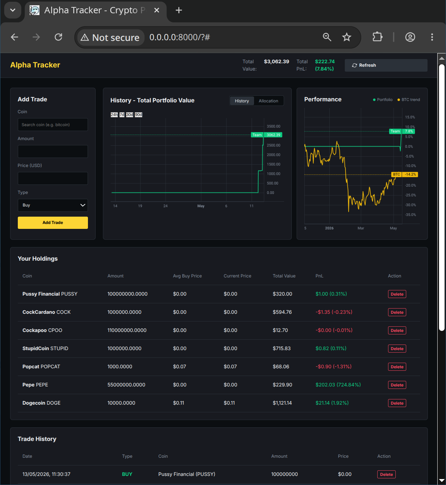

# Alpha Tracker (Crypto Portfolio Solo)

## Overview
### Problem
- **Who is affected?**: Crypto investors and traders who need to track multiple assets against benchmarks.
- **What is the issue?**: Keeping track of trades, calculating real-time profit and loss with cost basis, and comparing performance against a benchmark (like BTC) often requires using multiple disconnected tools, paid services, or manual spreadsheets.

### Outcome
- **What was achieved?**: Developed a self-hosted, dark-themed portfolio tracker that allows users to log their crypto trades, fetches real-time prices using the CoinGecko API, and visualizes P&L and performance against a BTC benchmark using TradingView Lightweight Charts.
- **Measurable results (if any)**: Fully functional local portfolio tracker with zero reliance on cloud-based databases.

---
## Demo
- **How does the solution work from the user’s perspective**:
  1. The user launches the application and is presented with a dashboard showing their current portfolio holdings, total value, and P&L.
  2. The user can search for a new coin to add using the "Coin Search" feature (fetching directly from CoinGecko).
  3. The user logs a buy/sell transaction by specifying the coin, amount, and price.
  4. The dashboard automatically updates the real-time pricing and recalculates the P&L.
  5. The historical chart displays the portfolio performance over time, overlaid with a BTC benchmark for comparison.

- **Demo Media**:
  

---
## Technology Stack
### Frontend components:
- **HTML/CSS/JS (Vanilla)**: Core structure, responsive dark-themed styling, and interactive elements.
- **TradingView Lightweight Charts (v5.2)**: Used for high-performance historical data rendering and benchmark overlay.

### Backend components:
- **Python 3.14 + FastAPI**: Async REST API handling client requests, processing business logic, and proxying external API calls. Pydantic models are used for request/response validation.
- **DuckDB**: File-based OLAP database for fast, local storage of trade data and cached API responses without needing a separate server.
- **CoinGecko Pro API (`coingecko_sdk`)**: Provides real-time and historical pricing data, proxied through the backend to handle rate limiting and security.

---
## Development Approach with AI
- **List of AI tools, services, models, and their purposes**:
  - **Antigravity (Gemini 3.1 Pro)**: Used as the primary agentic coding assistant to design the architecture, write backend routes, configure the DuckDB schema, and implement the frontend interface.
- **List of AI agents, including roles and skills**:
  - **Antigravity Agent**: Acted as a full-stack engineer and architect, utilizing skills such as full-codebase context understanding, code generation, and test-driven development.
- **List of key prompts used**:
  - "Build a complete Crypto Portfolio Solo web application from scratch using Python (FastAPI), DuckDB, and TradingView Lightweight Charts."
  - "Enhance the crypto portfolio tracker by implementing real-time data updates, improving performance visualizations, and adding interactive dashboard controls."
- **List of key review points and the corresponding decision made**:
  - *Review Point*: Choosing the database for a solo project. *Decision*: Selected DuckDB for its simple file-based nature, eliminating the need for a separate DB server while offering powerful analytical query capabilities.
  - *Review Point*: Handling API rate limits. *Decision*: Proxied all CoinGecko API calls through the backend and used DuckDB to cache responses, preventing rate-limiting issues on the frontend.

---
## Installation
Steps to setup the project workspace:
```bash
# 1. Git clone the project
git clone https://github.com/cloudostrich/cryptoportfolio_solo.git
# 2. Change directory to project
cd cryptoportfolio_solo
# 3. Setup the python virtual environment
python3 -m venv .venv
```

Steps to run the project from the workspace root:

```bash
# 1. Activate the shared virtual environment
source .venv/bin/activate

# 2. Install backend dependencies (if not already installed)
pip install -r requirements.txt

# 3. Set up your environment variables
cp .env.example .env
# Edit .env to include your COINGECKO_PRO_API_KEY

# 4. Initialise the database
python -m src.backend.db.init_db
```

---
## Usage
How to start and use the application:

```bash
source .venv/bin/activate

# Start the FastAPI dev server
uvicorn src.backend.main:app --reload --host 0.0.0.0 --port 8000
```
- Open `http://localhost:8000` in your web browser.
- Use the UI to search for coins, add trades, and view your portfolio summary and charts.
- API endpoints are available under `/api/` (e.g., `/api/portfolio/summary`).

---
## Project Structure
- `src/backend/`: Contains the FastAPI application, divided into `main.py` (entrypoint), `routes/` (API endpoints), `models/` (Pydantic schemas), `services/` (business logic), and `db/` (DuckDB interactions).
- `src/frontend/`: Static files served by FastAPI, including `index.html`, `css/`, and `js/` for the UI.
- `tests/`: Automated test suite using `pytest` to ensure backend reliability.
- `data/`: Local directory where the DuckDB database files are stored.
- `docs/` & `scripts/`: Additional documentation and utility scripts for project maintenance.

---
## Reflection
- **What worked**: Integrating DuckDB proved to be very efficient for a local, file-based tracker. It simplified the setup without compromising query performance. TradingView Lightweight Charts offered a very smooth experience for rendering data.
- **What failed**: Direct client-side calls to CoinGecko initially caused rate-limiting and exposed API keys.
- **Changes made**: Moved all external API calls to the backend. Created an abstraction layer using `coingecko_sdk` with built-in retries and caching in DuckDB.
- **Rationale**: Prioritized security and reliability for the end user, ensuring a consistent experience without API blocks.
